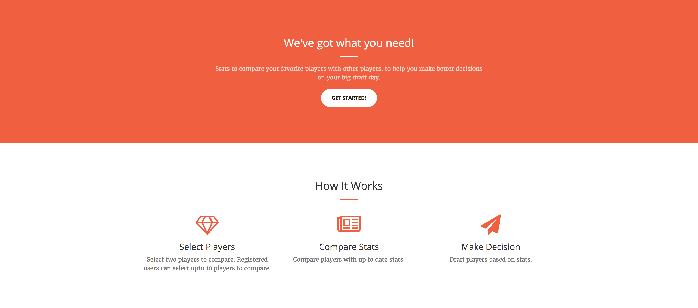
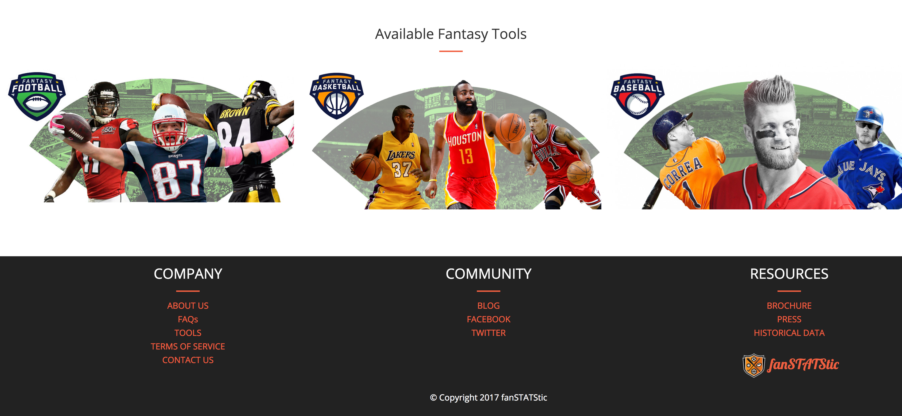
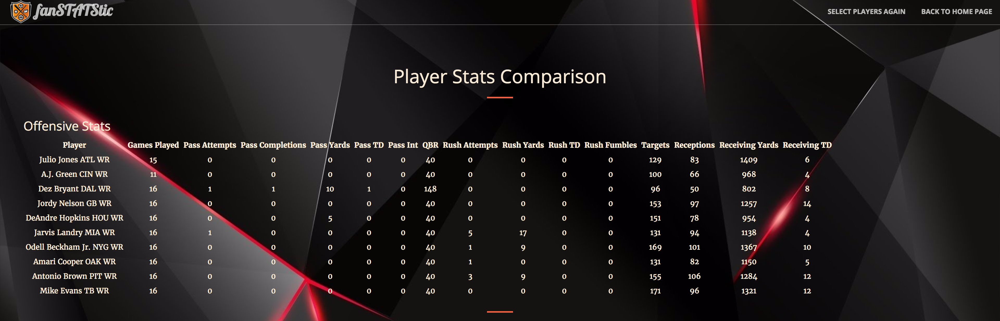

# Project2-fanSTATStic

## Description
fanSTATStic is a website for sports fan who want to compare the stats of many player in one search. Also, it is a research site for fantasy players to do their research before their league drafts.

## URL
https://secret-everglades-38178.herokuapp.com/

## Screenshots
### Homepage

### Selecting players

### Stats

## Technologies used
You can give a brief listing of the technologies you've learned and applied here
- HTML
- CSS/Bootstrap
- Javascript/Jquery
- node.js
- passport.js
- Express
- MySQL
- Sequelize
- Type Ahead
- EJS
- JawsDB
- Heroku
- Font Awesome
- Reveal.js
- Handlebard

## Getting Started
To get a copy for testing purpose, please download repo as zip. Run server.js using node, and http://localhost:3000/ as URL for testing purpose.

## Built With
* Creative - Template of choice from Start Bootstrap
* My Sports Feeds API/Data

## Current Functionality
Currently fanSTATStic only allows you to compare 2016 NFL stats.

## Plans for Future Functionality
In future, we plan to add following features:
- Add additional sports (NBA, MLB etc)
- Incorportate historical data and live data
- Give live suggestion of alternate players to fantasy players if their first choice player is already drafted.
- Mobile App
- Best daily fantasy lineups
- AI Machine Learning

## Contributors
* Anthony Myhere
* Jimmy Joseph
* Faras Momin
* Wenhoa Chan

## Acknowledgments
Special thanks to all the instructors and TAs of Coding Bootcamp in Houston.
